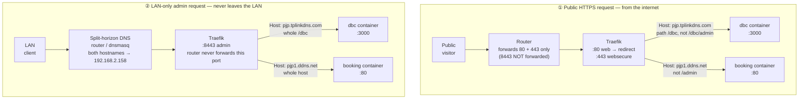

# Traefik Reverse Proxy — Two Domains, Two Apps

This documents the full setup that lets a single Traefik instance on one
server terminate TLS for **two independent public domains**, each pointing
at a **different application**, while also exposing a **LAN-only admin
path** for each app that never touches the public internet.

| Domain                   | App        | Public path(s)             | LAN-only admin path            |
| ------------------------ | ---------- | --------------------------- | ------------------------------- |
| `pjp.tplinkdns.com`      | `dbc`      | `/dbc` (excl. `/dbc/admin`) | `/dbc/admin` (via port `:8443`) |
| `pjp1.ddns.net`          | `booking`  | `/` (excl. `/admin`)        | `/admin` (via port `:8443`)     |

Both domains are free Dynamic DNS (DDNS) hostnames pointing at the same
home connection / server, since there's no static WAN IP.

---

## 1. Architecture



`dbc container` / `booking container` appear once per flow above purely so
the two request paths can be laid out without crossing lines — in reality
each app has exactly one running container, reachable via either flow.

Key ideas baked into the diagram:

- **One Traefik container, one shared external Docker network (`web`)**
  fronts every app. Apps never publish ports directly (`expose`, not
  `ports`) — the only way in is through Traefik.
- **Three entrypoints** separate traffic by trust level: `web` (80, only
  used to redirect), `websecure` (443, public internet), `admin` (8443,
  LAN-only because the router never forwards it).
- **Routing rules combine `Host()` + `PathPrefix()` + negation** so the
  *same* public router can never match an admin path, while a *second*,
  admin-only router (bound to the `admin` entrypoint) matches the full app
  and is only reachable from the LAN.

---

## 2. Repo / directory layout

```
~/traefik/                  # Traefik itself
  docker-compose.yml
  .env                      # ACME_EMAIL for Let's Encrypt
  letsencrypt/acme.json     # cert storage (chmod 600, do not commit)

~/dbc/                      # App 1 — Next.js "Digital Business Card"
  docker-compose.yml        # traefik labels for pjp.tplinkdns.com
  Dockerfile
  next.config.ts            # basePath: "/dbc"
  app/page.tsx               # public home page
  app/admin/page.tsx         # admin page (LAN-only in practice)

~/booking/                  # App 2 — Vite/React SPA behind nginx
  docker-compose.yml        # traefik labels for pjp1.ddns.net
  Dockerfile
  nginx.conf
  src/App.jsx                # client-side router: "/admin" vs everything else
```

Each app is a completely separate Docker Compose project; the only thing
tying them together is the shared external `web` network and the Traefik
container watching the Docker socket for label changes.

---

## 3. Traefik core setup (`~/traefik`)

`docker-compose.yml` config (see `36:services.traefik.command` above)
does four things:

1. **Entrypoints** — `web:80`, `websecure:443`, `admin:8443`.
2. **HTTP → HTTPS redirect** on the `web` entrypoint, so nobody ever
   stays on plain HTTP.
3. **Docker provider** with `exposedbydefault=false` — a container is
   only routed if it explicitly opts in with `traefik.enable=true`
   labels. `providers.docker.network=web` tells Traefik which network to
   reach backends on (needed because Traefik itself isn't on every
   compose project's default network).
4. **Let's Encrypt (`le`) resolver** using the HTTP-01 challenge, which
   is why port 80 must reach Traefik from the internet even though it
   otherwise just redirects — ACME's challenge requests hit it directly
   before the redirect logic matters.

`.env` holds `ACME_EMAIL`, used for Let's Encrypt registration/expiry
notices.

`letsencrypt/acme.json` is where issued certificates are persisted. It
must be `chmod 600` (Traefik will refuse to start otherwise) and should
never be committed to version control — it contains private keys.

### One-time host prerequisites

```bash
# Shared network all app compose projects attach to
docker network create web

# Certificate storage must exist and be locked down
mkdir -p ~/traefik/letsencrypt
touch ~/traefik/letsencrypt/acme.json
chmod 600 ~/traefik/letsencrypt/acme.json

cd ~/traefik && docker compose up -d
```

Bring each app up the same way (`cd ~/dbc && docker compose up -d`, then
`~/booking`) — order doesn't matter as long as `web` network and Traefik
exist first.

---

## 4. Per-app routing labels

Each app's own `docker-compose.yml` carries the Traefik labels — Traefik
never needs a static config file per app; it discovers everything from
Docker labels.

### App 1 — `dbc` (path-based routing under a shared domain-style setup)

```yaml
labels:
  - "traefik.enable=true"
  - "traefik.docker.network=web"
  # Public router: whole host, minus the admin subpath
  - "traefik.http.routers.dbc.rule=Host(`pjp.tplinkdns.com`) && PathPrefix(`/dbc`) && !PathPrefix(`/dbc/admin`)"
  - "traefik.http.routers.dbc.entrypoints=websecure"
  - "traefik.http.routers.dbc.tls=true"
  - "traefik.http.routers.dbc.tls.certresolver=le"
  - "traefik.http.routers.dbc.service=dbc"
  # LAN-only router: same service, but the FULL /dbc prefix, on :8443 only
  - "traefik.http.routers.dbc-admin.rule=Host(`pjp.tplinkdns.com`) && PathPrefix(`/dbc`)"
  - "traefik.http.routers.dbc-admin.entrypoints=admin"
  - "traefik.http.routers.dbc-admin.tls=true"
  - "traefik.http.routers.dbc-admin.tls.certresolver=le"
  - "traefik.http.routers.dbc-admin.service=dbc"
  - "traefik.http.services.dbc.loadbalancer.server.port=3000"
```

Notes:

- The Next.js app is built with `basePath: "/dbc"`, so it only ever
  answers under that prefix — the same container backs both routers,
  the routers just differ in *which paths reach it* and *which
  entrypoint they listen on*.
- The admin router intentionally matches the whole `/dbc` prefix (not
  just `/dbc/admin`) so that Next.js's static assets
  (`/dbc/_next/*`) also load correctly when browsing the admin page on
  `:8443`.
- Because `pjp.tplinkdns.com`'s DDNS nameservers have occasionally been
  unreachable from Let's Encrypt's validation servers, the `:8443`
  router may end up serving Traefik's fallback **self-signed**
  certificate instead of a real one — expect a browser warning to click
  through until that's resolved. `:443` is unaffected since it only
  needs the HTTP-01 challenge to succeed once.

### App 2 — `booking` (whole-domain app, path-based admin split)

```yaml
labels:
  - "traefik.enable=true"
  - "traefik.docker.network=web"
  - "traefik.http.routers.booking.rule=Host(`pjp1.ddns.net`) && !PathPrefix(`/admin`)"
  - "traefik.http.routers.booking.entrypoints=websecure"
  - "traefik.http.routers.booking.tls=true"
  - "traefik.http.routers.booking.tls.certresolver=le"
  - "traefik.http.routers.booking.service=booking"
  - "traefik.http.routers.booking-admin.rule=Host(`pjp1.ddns.net`)"
  - "traefik.http.routers.booking-admin.entrypoints=admin"
  - "traefik.http.routers.booking-admin.tls=true"
  - "traefik.http.routers.booking-admin.tls.certresolver=le"
  - "traefik.http.routers.booking-admin.service=booking"
  - "traefik.http.services.booking.loadbalancer.server.port=80"
```

This app owns its whole domain (no path prefix), so the public router
just excludes `/admin`. The React SPA itself also enforces the split
client-side (`src/App.jsx` renders `<Admin />` only for `/admin`), but
Traefik is the real security boundary — the SPA-level check is only a
UX nicety, since the `/admin` bundle is never served on `:443` at all.

### General pattern for adding a third app/domain

1. Pick a public domain (or path, if reusing an existing domain) and a
   LAN-only admin sub-path.
2. Put the new service on the external `web` network, `expose` (not
   `ports`) its internal port.
3. Add a public router: `Host(...) [&& PathPrefix(...)] && !PathPrefix(<admin path>)`,
   `entrypoints=websecure`, `tls.certresolver=le`.
4. Add a matching `-admin` router with the same `Host()`/prefix (without
   the negation), `entrypoints=admin`.
5. Point the router's DNS entry (public + LAN split-horizon, see below)
   at the server.
6. `docker compose up -d` — no Traefik restart needed, it picks up new
   labels automatically via the Docker provider.

---

## 5. DNS & router setup

### 5.1 Public DNS — Dynamic DNS (DDNS)

Neither domain is a "real" purchased domain; both are free DDNS
hostnames from two different providers, because there's no static WAN
IP:

- `pjp.tplinkdns.com` — TP-Link's own DDNS service.
- `pjp1.ddns.net` — a No-IP/Dynu-style `ddns.net` hostname.

Most consumer routers (including TP-Link ones) have a built-in **Dynamic
DNS client** under something like *Advanced → Network → Dynamic DNS*
that can register with a couple of these providers directly, and it will
keep the hostname's A record updated whenever the WAN IP changes — no
extra software needed on the server. Configure one DDNS provider entry
per hostname there (create the free account with each DDNS provider
first, then plug the credentials into the router's DDNS client). If your
router only supports one DDNS provider at a time, alternative is a small
DDNS updater client (e.g. `ddclient`) running on the server itself
instead.

### 5.2 Router port forwarding (WAN-facing)

On the router's *Port Forwarding / Virtual Server* page, forward only:

| External port | Internal target        | Purpose                          |
| -------------- | ----------------------- | --------------------------------- |
| `80/tcp`       | `192.168.2.158:80`      | ACME HTTP-01 challenge + HTTPS redirect |
| `443/tcp`      | `192.168.2.158:443`     | Public HTTPS traffic for both apps |
| `8443/tcp`     | **not forwarded**       | Keeps the admin entrypoint LAN-only |

This is the entire mechanism that makes the admin paths "not public
facing": Traefik listens on `8443` and will happily route
`/dbc/admin` or `/admin` there, but the router simply never lets an
internet packet reach that port, so it's only reachable from inside the
LAN (or over VPN into the LAN).

### 5.3 LAN split-horizon DNS (for reaching `:8443` internally)

Both apps link to their admin page using the *same public hostname*,
e.g. `https://pjp1.ddns.net:8443/admin`, so that Traefik's Host-based
routing and TLS/SNI matching work identically to the public routers.
That means LAN clients need `pjp.tplinkdns.com` and `pjp1.ddns.net` to
resolve to the server's **LAN IP** (`192.168.2.158`), not the public WAN
IP — many routers don't support NAT hairpinning/loopback cleanly, and
even when they do, it adds pointless round trips through the ISP.

Set this up with a local DNS override such as one of:

- **Router's built-in local DNS / "DNS rewrite" feature**, if it has
  one — add both hostnames pointing to `192.168.2.158`.
- **A LAN DNS resolver like Pi-hole or `dnsmasq`**, with the router's
  DHCP handing out that resolver's address, and two local DNS records:
  ```
  address=/pjp.tplinkdns.com/192.168.2.158
  address=/pjp1.ddns.net/192.168.2.158
  ```
- **Static `/etc/hosts` (or Windows `hosts`) entries** on any specific
  LAN device that needs admin access, as a fallback when there's no
  central LAN resolver:
  ```
  192.168.2.158  pjp.tplinkdns.com
  192.168.2.158  pjp1.ddns.net
  ```

Without one of these, LAN devices would resolve the hostnames to the
public WAN IP via normal internet DNS, hit the router on `:8443`, and
get nothing (since that port isn't forwarded) — split-horizon DNS is
what makes the "LAN-only" admin links actually work from inside the LAN
rather than only from `localhost` on the server.

---

## 6. TLS / Let's Encrypt notes

- Certificates are requested per-domain (SNI/`Host()`), stored together
  in `letsencrypt/acme.json`, and auto-renewed by Traefik.
- The **HTTP-01** challenge requires port 80 reachable from the public
  internet at the moment a cert is (re)issued — this is why port 80 stays
  forwarded even though its only job otherwise is redirecting to 443.
- If a DDNS provider's authoritative nameservers are flaky, Let's
  Encrypt's validation can fail intermittently; when that happens
  Traefik falls back to a self-signed default certificate for that
  domain until validation succeeds, which shows up as a browser
  security warning. This has been observed specifically on
  `pjp.tplinkdns.com`; `pjp1.ddns.net` has had a valid cert.
- To test config changes without burning Let's Encrypt's rate limits,
  temporarily uncomment the staging CA line in the Traefik command:
  `--certificatesresolvers.le.acme.caserver=https://acme-staging-v02.api.letsencrypt.org/directory`.

---

## 7. Quick troubleshooting checklist

- **New service not picked up?** Confirm it's on the `web` network,
  has `traefik.enable=true`, and `traefik.docker.network=web` is set if
  the container has more than one network attached.
- **404/"no matching router"?** Router rules are evaluated by
  specificity, not declaration order — an overly broad rule on another
  service could be winning. Check `docker logs traefik`.
- **Admin path reachable from outside?** Verify the router isn't
  forwarding `8443`, and that the public router for that app has the
  `!PathPrefix(...)` / whole-path exclusion in its rule.
- **Cert warnings on `:8443` only?** Expected if HTTP-01 validation for
  that domain hasn't succeeded yet (see §6) — it doesn't affect the
  public `:443` site.
- **Admin link doesn't load from a LAN device?** Check that device is
  actually using the split-horizon resolver (run `nslookup
  pjp1.ddns.net` on it — it should return `192.168.2.158`, not the
  public IP).
