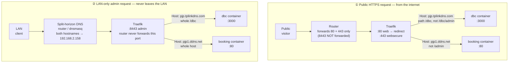

# Traefik Reverse Proxy — Two Domains, Two Apps

This documents the full setup that lets a single Traefik instance on one
server terminate TLS for **two independent public domains**, each pointing
at a **different application**, while also exposing a **LAN-only admin
path** for each app that never touches the public internet.

| Domain                   | App        | Public path(s)             | LAN-only admin path            |
| ------------------------ | ---------- | --------------------------- | ------------------------------- |
| `pjp.tplinkdns.com`      | `dbc`      | `/dbc` (excl. `/dbc/admin`) | `/dbc/admin` (via port `:8443`) |
| `pjp1.ddns.net`          | `booking`  | `/` (excl. `/admin`)        | `/admin` (via port `:8443`)     |

Both domains are free Dynamic DNS (DDNS) hostnames pointing at the same
home connection / server, since there's no static WAN IP.

---

## 1. Architecture



`dbc container` / `booking container` appear once per flow above purely so
the two request paths can be laid out without crossing lines — in reality
each app has exactly one running container, reachable via either flow.

Key ideas baked into the diagram:

- **One Traefik container, one shared external Docker network (`web`)**
  fronts every app. Apps never publish ports directly (`expose`, not
  `ports`) — the only way in is through Traefik.
- **Three entrypoints** separate traffic by trust level: `web` (80, only
  used to redirect), `websecure` (443, public internet), `admin` (8443,
  LAN-only because the router never forwards it).
- **Routing rules combine `Host()` + `PathPrefix()` + negation** so the
  *same* public router can never match an admin path, while a *second*,
  admin-only router (bound to the `admin` entrypoint) matches the full app
  and is only reachable from the LAN.

---

## 2. Repo / directory layout

```
~/traefik/                  # Traefik itself
  docker-compose.yml
  .env                      # ACME_EMAIL for Let's Encrypt
  letsencrypt/acme.json     # cert storage (chmod 600, do not commit)

~/dbc/                      # App 1 — Next.js "Digital Business Card"
  docker-compose.yml        # traefik labels for pjp.tplinkdns.com
  Dockerfile
  next.config.ts            # basePath: "/dbc"
  app/page.tsx               # public home page
  app/admin/page.tsx         # admin page (LAN-only in practice)

~/booking/                  # App 2 — Vite/React SPA behind nginx
  docker-compose.yml        # traefik labels for pjp1.ddns.net
  Dockerfile
  nginx.conf
  src/App.jsx                # client-side router: "/admin" vs everything else
```

Each app is a completely separate Docker Compose project; the only thing
tying them together is the shared external `web` network and the Traefik
container watching the Docker socket for label changes.

---

## 3. Traefik core setup (`~/traefik`)

`docker-compose.yml` config (see `36:services.traefik.command` above)
does four things:

1. **Entrypoints** — `web:80`, `websecure:443`, `admin:8443`.
2. **HTTP → HTTPS redirect** on the `web` entrypoint, so nobody ever
   stays on plain HTTP.
3. **Docker provider** with `exposedbydefault=false` — a container is
   only routed if it explicitly opts in with `traefik.enable=true`
   labels. `providers.docker.network=web` tells Traefik which network to
   reach backends on (needed because Traefik itself isn't on every
   compose project's default network).
4. **Let's Encrypt (`le`) resolver** using the HTTP-01 challenge, which
   is why port 80 must reach Traefik from the internet even though it
   otherwise just redirects — ACME's challenge requests hit it directly
   before the redirect logic matters.

`.env` holds `ACME_EMAIL`, used for Let's Encrypt registration/expiry
notices.

`letsencrypt/acme.json` is where issued certificates are persisted. It
must be `chmod 600` (Traefik will refuse to start otherwise) and should
never be committed to version control — it contains private keys.

### One-time host prerequisites

```bash
# Shared network all app compose projects attach to
docker network create web

# Certificate storage must exist and be locked down
mkdir -p ~/traefik/letsencrypt
touch ~/traefik/letsencrypt/acme.json
chmod 600 ~/traefik/letsencrypt/acme.json

cd ~/traefik && docker compose up -d
```

Bring each app up the same way (`cd ~/dbc && docker compose up -d`, then
`~/booking`) — order doesn't matter as long as `web` network and Traefik
exist first.

---

## 4. Per-app routing labels

Each app's own `docker-compose.yml` carries the Traefik labels — Traefik
never needs a static config file per app; it discovers everything from
Docker labels.

### App 1 — `dbc` (path-based routing under a shared domain-style setup)

```yaml
labels:
  - "traefik.enable=true"
  - "traefik.docker.network=web"
  # Public router: whole host, minus the admin subpath
  - "traefik.http.routers.dbc.rule=Host(`pjp.tplinkdns.com`) && PathPrefix(`/dbc`) && !PathPrefix(`/dbc/admin`)"
  - "traefik.http.routers.dbc.entrypoints=websecure"
  - "traefik.http.routers.dbc.tls=true"
  - "traefik.http.routers.dbc.tls.certresolver=le"
  - "traefik.http.routers.dbc.service=dbc"
  # LAN-only router: same service, but the FULL /dbc prefix, on :8443 only
  - "traefik.http.routers.dbc-admin.rule=Host(`pjp.tplinkdns.com`) && PathPrefix(`/dbc`)"
  - "traefik.http.routers.dbc-admin.entrypoints=admin"
  - "traefik.http.routers.dbc-admin.tls=true"
  - "traefik.http.routers.dbc-admin.tls.certresolver=le"
  - "traefik.http.routers.dbc-admin.service=dbc"
  - "traefik.http.services.dbc.loadbalancer.server.port=3000"
```

Notes:

- The Next.js app is built with `basePath: "/dbc"`, so it only ever
  answers under that prefix — the same container backs both routers,
  the routers just differ in *which paths reach it* and *which
  entrypoint they listen on*.
- The admin router intentionally matches the whole `/dbc` prefix (not
  just `/dbc/admin`) so that Next.js's static assets
  (`/dbc/_next/*`) also load correctly when browsing the admin page on
  `:8443`.
- Because `pjp.tplinkdns.com`'s DDNS nameservers have occasionally been
  unreachable from Let's Encrypt's validation servers, the `:8443`
  router may end up serving Traefik's fallback **self-signed**
  certificate instead of a real one — expect a browser warning to click
  through until that's resolved. `:443` is unaffected since it only
  needs the HTTP-01 challenge to succeed once.

### App 2 — `booking` (whole-domain app, path-based admin split)

```yaml
labels:
  - "traefik.enable=true"
  - "traefik.docker.network=web"
  - "traefik.http.routers.booking.rule=Host(`pjp1.ddns.net`) && !PathPrefix(`/admin`)"
  - "traefik.http.routers.booking.entrypoints=websecure"
  - "traefik.http.routers.booking.tls=true"
  - "traefik.http.routers.booking.tls.certresolver=le"
  - "traefik.http.routers.booking.service=booking"
  - "traefik.http.routers.booking-admin.rule=Host(`pjp1.ddns.net`)"
  - "traefik.http.routers.booking-admin.entrypoints=admin"
  - "traefik.http.routers.booking-admin.tls=true"
  - "traefik.http.routers.booking-admin.tls.certresolver=le"
  - "traefik.http.routers.booking-admin.service=booking"
  - "traefik.http.services.booking.loadbalancer.server.port=80"
```

This app owns its whole domain (no path prefix), so the public router
just excludes `/admin`. The React SPA itself also enforces the split
client-side (`src/App.jsx` renders `<Admin />` only for `/admin`), but
Traefik is the real security boundary — the SPA-level check is only a
UX nicety, since the `/admin` bundle is never served on `:443` at all.

### General pattern for adding a third app/domain

1. Pick a public domain (or path, if reusing an existing domain) and a
   LAN-only admin sub-path.
2. Put the new service on the external `web` network, `expose` (not
   `ports`) its internal port.
3. Add a public router: `Host(...) [&& PathPrefix(...)] && !PathPrefix(<admin path>)`,
   `entrypoints=websecure`, `tls.certresolver=le`.
4. Add a matching `-admin` router with the same `Host()`/prefix (without
   the negation), `entrypoints=admin`.
5. Point the router's DNS entry (public + LAN split-horizon, see below)
   at the server.
6. `docker compose up -d` — no Traefik restart needed, it picks up new
   labels automatically via the Docker provider.

---

## 5. DNS & router setup

### 5.1 Public DNS — Dynamic DNS (DDNS)

Neither domain is a "real" purchased domain; both are free DDNS
hostnames from two different providers, because there's no static WAN
IP:

- `pjp.tplinkdns.com` — TP-Link's own DDNS service.
- `pjp1.ddns.net` — a No-IP/Dynu-style `ddns.net` hostname.

Most consumer routers (including TP-Link ones) have a built-in **Dynamic
DNS client** under something like *Advanced → Network → Dynamic DNS*
that can register with a couple of these providers directly, and it will
keep the hostname's A record updated whenever the WAN IP changes — no
extra software needed on the server. Configure one DDNS provider entry
per hostname there (create the free account with each DDNS provider
first, then plug the credentials into the router's DDNS client). If your
router only supports one DDNS provider at a time, alternative is a small
DDNS updater client (e.g. `ddclient`) running on the server itself
instead.

### 5.2 Router port forwarding (WAN-facing)

On the router's *Port Forwarding / Virtual Server* page, forward only:

| External port | Internal target        | Purpose                          |
| -------------- | ----------------------- | --------------------------------- |
| `80/tcp`       | `192.168.2.158:80`      | ACME HTTP-01 challenge + HTTPS redirect |
| `443/tcp`      | `192.168.2.158:443`     | Public HTTPS traffic for both apps |
| `8443/tcp`     | **not forwarded**       | Keeps the admin entrypoint LAN-only |

This is the entire mechanism that makes the admin paths "not public
facing": Traefik listens on `8443` and will happily route
`/dbc/admin` or `/admin` there, but the router simply never lets an
internet packet reach that port, so it's only reachable from inside the
LAN (or over VPN into the LAN).

### 5.3 LAN split-horizon DNS (for reaching `:8443` internally)

Both apps link to their admin page using the *same public hostname*,
e.g. `https://pjp1.ddns.net:8443/admin`, so that Traefik's Host-based
routing and TLS/SNI matching work identically to the public routers.
That means LAN clients need `pjp.tplinkdns.com` and `pjp1.ddns.net` to
resolve to the server's **LAN IP** (`192.168.2.158`), not the public WAN
IP — many routers don't support NAT hairpinning/loopback cleanly, and
even when they do, it adds pointless round trips through the ISP.

Set this up with a local DNS override such as one of:

- **Router's built-in local DNS / "DNS rewrite" feature**, if it has
  one — add both hostnames pointing to `192.168.2.158`.
- **A LAN DNS resolver like Pi-hole or `dnsmasq`**, with the router's
  DHCP handing out that resolver's address, and two local DNS records:
  ```
  address=/pjp.tplinkdns.com/192.168.2.158
  address=/pjp1.ddns.net/192.168.2.158
  ```
- **Static `/etc/hosts` (or Windows `hosts`) entries** on any specific
  LAN device that needs admin access, as a fallback when there's no
  central LAN resolver:
  ```
  192.168.2.158  pjp.tplinkdns.com
  192.168.2.158  pjp1.ddns.net
  ```

Without one of these, LAN devices would resolve the hostnames to the
public WAN IP via normal internet DNS, hit the router on `:8443`, and
get nothing (since that port isn't forwarded) — split-horizon DNS is
what makes the "LAN-only" admin links actually work from inside the LAN
rather than only from `localhost` on the server.

---

## 6. TLS / Let's Encrypt notes

- Certificates are requested per-domain (SNI/`Host()`), stored together
  in `letsencrypt/acme.json`, and auto-renewed by Traefik.
- The **HTTP-01** challenge requires port 80 reachable from the public
  internet at the moment a cert is (re)issued — this is why port 80 stays
  forwarded even though its only job otherwise is redirecting to 443.
- If a DDNS provider's authoritative nameservers are flaky, Let's
  Encrypt's validation can fail intermittently; when that happens
  Traefik falls back to a self-signed default certificate for that
  domain until validation succeeds, which shows up as a browser
  security warning. This has been observed specifically on
  `pjp.tplinkdns.com`; `pjp1.ddns.net` has had a valid cert.
- To test config changes without burning Let's Encrypt's rate limits,
  temporarily uncomment the staging CA line in the Traefik command:
  `--certificatesresolvers.le.acme.caserver=https://acme-staging-v02.api.letsencrypt.org/directory`.

### 6.1 How renewal actually happens

Traefik has a built-in ACME client (based on the `lego` library) — there's
no `certbot` or cron job involved.

- **Initial issuance**: the first time a router with
  `tls.certresolver=le` is seen for a given `Host()`, Traefik requests a
  cert from Let's Encrypt for that domain.
- **Renewal trigger**: Traefik tracks each cert's expiry itself. Let's
  Encrypt certs are valid 90 days; Traefik checks expiry roughly every
  24h and renews any cert that's within **30 days** of expiring — fully
  autonomous, no external scheduler needed.
- **Challenge mechanics**: renewal re-runs the exact same HTTP-01
  challenge as initial issuance — Let's Encrypt's servers hit
  `http://<domain>/.well-known/acme-challenge/...` on port 80, which is
  why port 80 must stay forwarded even though its only "normal" job is
  the HTTPS redirect.
- **Storage**: the renewed cert + key are written back into
  `letsencrypt/acme.json`, keyed by the `le` resolver name and domain —
  same file, same account, just an updated `Certificates` array entry.

### 6.2 How Traefik loads the renewed cert without a restart

This is the opposite behavior from the file-provider gotcha in §7. Two
separate mechanisms exist in Traefik:

- **Declarative certs** (file provider, Docker labels' `tls.certificates`,
  etc.) go through the generic dynamic-config merge logic, which diffs
  the whole parsed config and **skips adding a cert for a domain that
  already has a slot in the store** — exactly why the `test-tls.yml`
  trick in §7 needs a separate hostname and a brand-new file path per run
  to force a "changed config."
- **ACME resolver certs are different**: the `le` resolver owns its
  domain→cert mapping directly. When it renews a certificate, it
  explicitly replaces its own entry in Traefik's in-memory TLS store for
  that domain — it doesn't go through the "is this a new domain, skip if
  exists" diff path that trips up the file provider. The swap is a
  genuine hot in-memory update: existing connections keep using the old
  cert (TLS handshake already picked it), but any **new** TLS handshake
  after the renewal gets the fresh certificate immediately. No
  `docker compose restart traefik`, no dropped connections, no manual
  step.

**Edge case**: if a DDNS provider's nameservers are flaky at the moment of
a *renewal* attempt (not just initial issuance), the HTTP-01 challenge
fails the same way it can on first issuance — Traefik just keeps serving
the old, still-valid cert until the next daily check succeeds, so nothing
is user-visible unless the failures persist long enough for the old cert
to actually expire (at which point it falls back to the self-signed
default, same symptom as §6's bullet above).

### 6.3 What if port 80 is closed *specifically at renewal time*?

A natural question: since the domain already has a cert and an account
with Let's Encrypt, does renewal skip validation? **No** — prior
registration with the CA doesn't exempt a renewal from proving domain
control again. What *can* skip it is a still-valid **authorization
reuse** window (currently 30 days on Let's Encrypt's default profile,
shrinking to 10 days in 2027 and 7 hours by 2028) — but that window is
tied to *when a challenge last succeeded*, not to the account or domain
being "known."

Under this setup's normal cadence, that reuse window doesn't help:
Traefik renews **30 days before** the 90-day cert expires (i.e. around
day 60 of its life), while the authorization from the original issuance
(day 0) already expired at day 30. So by the time a renewal actually
happens, the previous validation is long gone and a **fresh HTTP-01
challenge is always required** — renewal behaves just like a brand-new
domain in that respect.

If port 80 is closed when that renewal attempt happens:

1. Traefik opens a new order and Let's Encrypt tries to fetch
   `http://<domain>/.well-known/acme-challenge/<token>` on port 80.
2. Connection fails (refused/timeout) → Let's Encrypt marks the
   challenge invalid, Traefik logs a renewal error.
3. Traefik does **not** apply special backoff/retry logic for that
   attempt — it simply waits for its next periodic renewal check
   (effectively a daily loop) and tries again automatically once port 80
   is reachable again, no manual action needed.
4. A failed attempt never touches the certificate currently loaded —
   the store entry only gets swapped on a *successful* renewal, so
   Traefik keeps serving the existing, still-valid cert throughout.
5. Only if the outage lasts long enough that the existing cert reaches
   its hard expiry (i.e. every daily retry failed for the whole 30-day
   renewal window) does Traefik run out of a valid cert to serve and
   fall back to the self-signed default for that domain.

**Extra risk for a flaky DDNS domain like `pjp.tplinkdns.com`**: repeated
failed challenges against the *same hostname* in a short window can trip
Let's Encrypt's "too many failed authorizations" rate limit (5
failures/hour per hostname/account). That means a prolonged port-80
outage doesn't just delay renewal — it can also block the next
legitimate attempt for an extra hour once connectivity is restored,
turning a short network blip into a longer cert outage than the
underlying issue alone would cause.

### 6.4 CA trust models compared (why "port 80 not needed" isn't universal)

Domain-validation reuse is a **CA policy choice**, not an ACME protocol
rule — the CA/Browser Forum Baseline Requirements only cap reuse at a
maximum of 398 days, and each CA decides where under that cap to sit.
That's why "does renewal need port 80?" has a different answer depending
on which CA is behind the resolver:

| CA | Validation reuse window | Practical effect on renewal |
| --- | --- | --- |
| **Let's Encrypt** (this repo's `le` resolver) | 30 days today, shrinking to 10 days (2027) then 7 hours (2028) — a deliberate security choice | Shorter than the ~60-day gap since last validation under the default 90-day/30-day-before cadence, so a **fresh HTTP-01/DNS-01 challenge is required on essentially every renewal** — port 80 (or a DNS API) must be reachable every time. |
| **Sectigo** and most commercial CAs | Close to the 398-day regulatory max | A challenge that succeeds once can be silently reused for over a year of renewals — a `certbot renew` can succeed with **no live challenge at all** if it falls inside that window, even from a non-internet-facing host. |
| **HARICA** (Enterprise account + pre-validated domain) | N/A — trust is established at the **organization/federation level**, not per-domain/per-challenge | No ACME challenge is ever required for domains already on the account's pre-validated list; a challenge is only needed the first time a *new* domain is added to the account. |

The takeaway for this repo: the port-80-reachability requirement in §6.3
is specific to Let's Encrypt's short, self-imposed reuse policy — it
isn't an inherent ACME limitation, and switching resolvers (see §9 for a
HARICA example) changes these tradeoffs substantially.

### 6.5 `acme.email` only supports one address — plan alerting accordingly

Traefik's ACME configuration has two email-related fields that are easy to
conflate:

- **`acme.email`** — the ACME **account's** registration contact. This is
  a single string, always has been (confirmed straight from Traefik's
  source: `Email string`, not a list) — there is no way to register more
  than one address for the account itself, on any Traefik version.
- **`acme.emailAddresses`** (Traefik **v3.4.0+** only — this repo currently
  runs `traefik:v3.1`, see `docker-compose.yml`, so it isn't available
  without a version bump) — a list of emails embedded into the
  certificate's **CSR**. This is unrelated metadata baked into the cert
  itself; it does not cause the CA to notify multiple people about
  anything.

Practical implications:

- If more than one person should be reachable through `ACME_EMAIL`, point
  it at a **mail alias / distribution list** that fans out to multiple
  inboxes — that's the only way to reach more than one person through
  this single-string field.
- Don't rely on this as your main safety net either way: Let's Encrypt has
  scaled back proactive "your cert expires soon" reminder emails in recent
  years (favoring automated renewal over manual reminders), so
  `acme.email` is weaker insurance than it used to be even with a single
  correct address.
- `scripts/check-cert-expiry.sh` (added alongside this note) is a more
  reliable, CA-independent alternative: it inspects the certificate
  Traefik is actually *serving* over the wire for each domain — not
  `acme.json` or anything tied to the ACME account — so it also catches
  the self-signed-fallback failure mode from §6 that `acme.email` would
  never surface either way. It supports alerting an arbitrary number of
  people via `ALERT_EMAILS` (comma-separated) and/or a Slack-style
  webhook. See the script's header comment for full usage and a suggested
  crontab entry.

---

## 7. Testing short-lived-cert renewal logic (`:8444`, self-signed)

Let's Encrypt cannot issue a certificate valid for only a couple of hours —
its shortest option is the `shortlived` ACME profile at ~160 hours (6 days),
and Traefik's built-in ACME provider doesn't support the ACME profile
extension anyway. To test renewal automation against a *very* short-lived
cert without touching the real `le` resolver or public traffic, there's a
dedicated internal-only setup:

- **`test` entrypoint (`:8444`)** — internal-only, same idea as `admin`
  (`:8443`): never port-forwarded on the router.
- **`traefik/test-certs/generate-2h-cert.sh`** — generates a self-signed
  cert/key for **`pjp1-test.ddns.net`** (not `pjp1.ddns.net` — see below)
  with an exact validity window (default 2 hours; pass a different number of
  hours as `$1`).
- **`traefik/dynamic/test-tls.yml.disabled`** — Traefik file-provider config
  that serves that cert. Kept inert via the `.disabled` suffix (the file
  provider only watches `*.yml`/`*.yaml`/`*.toml`).
- **`booking-test` router** (in `booking/docker-compose.yml`) — routes
  `pjp1-test.ddns.net` on the `test` entrypoint, no `certresolver` (there's
  nothing to request from ACME here; it just serves whatever the file
  provider currently has loaded, or Traefik's fallback self-signed default
  while the file is disabled).

### Why a separate hostname (`pjp1-test.ddns.net`), not `pjp1.ddns.net`

This isn't just for tidiness — it's required for hot-reloading to work at
all. Traefik's TLS store keeps **one certificate per domain**, and once a
domain's slot is filled, a *live* dynamic-config reload will never replace it
with a different certificate for that same domain (only a full process
restart re-evaluates the store from scratch — confirmed via
`--log.level=DEBUG`, which logs `Skipping addition of certificate for
domain(s) "pjp1.ddns.net" ... as it already exists for this store`).
`pjp1.ddns.net`'s slot is permanently held by `booking`'s real ACME
certificate, so a test cert issued for that same name would silently never
take effect after the first load. Using a distinct name that nothing else
claims sidesteps the conflict entirely, since it doesn't need real DNS —
testing is done via `curl --resolve` / `openssl s_client -servername`
against the server's own IP, never actual internet resolution.

### Two other non-obvious things the generator script handles

- **Traefik never watches `certFile`/`keyFile` contents, only the YAML/TOML
  files in `providers.file.directory`** — and it further **skips reloading
  TLS certs entirely if the parsed config is unchanged** between reloads.
  So the script doesn't just overwrite `pjp1.crt`/`pjp1.key` in place: each
  run builds a fresh `test-certs/releases/<timestamp>/` and rewrites
  `dynamic/test-tls.yml`'s `certFile`/`keyFile` to point at that new path —
  a genuinely different config on every run is what actually triggers a
  reload (see [traefik/traefik#3083](https://github.com/traefik/traefik/issues/3083),
  [#5495](https://github.com/traefik/traefik/issues/5495)).
- **The key+cert pair is never modified in place** (only ever written once,
  into a brand new release directory, then published via a single atomic
  symlink/config swap) — this avoids Traefik's watcher ever catching a
  half-written file and momentarily loading a mismatched key/cert pair
  (which fails with `tls: private key does not match public key`).

Usage:

```bash
# One-time setup
cd ~/traefik/test-certs && ./generate-2h-cert.sh   # creates test-certs/current
cd ~/traefik/dynamic && mv test-tls.yml.disabled test-tls.yml

# Every time you want a fresh short-lived cert (no restart needed):
cd ~/traefik/test-certs
./generate-2h-cert.sh          # 2 hours by default
./generate-2h-cert.sh 6        # or pass custom hours

# from the server itself, or a LAN device with an /etc/hosts entry for
# pjp1-test.ddns.net -> 192.168.2.158 (this hostname has no real DNS record):
curl -kv https://pjp1-test.ddns.net:8444/ --resolve pjp1-test.ddns.net:8444:192.168.2.158 \
  2>&1 | grep -E 'expire|subject'

# When done:
mv ~/traefik/dynamic/test-tls.yml ~/traefik/dynamic/test-tls.yml.disabled
```

Since it's self-signed, `curl` needs `-k` (or add it to a local trust store)
and browsers will show a warning — that's expected and harmless, this path
never carries real traffic or a real hostname.

---

## 8. Quick troubleshooting checklist

- **New service not picked up?** Confirm it's on the `web` network,
  has `traefik.enable=true`, and `traefik.docker.network=web` is set if
  the container has more than one network attached.
- **404/"no matching router"?** Router rules are evaluated by
  specificity, not declaration order — an overly broad rule on another
  service could be winning. Check `docker logs traefik`.
- **Admin path reachable from outside?** Verify the router isn't
  forwarding `8443`, and that the public router for that app has the
  `!PathPrefix(...)` / whole-path exclusion in its rule.
- **Cert warnings on `:8443` only?** Expected if HTTP-01 validation for
  that domain hasn't succeeded yet (see §6) — it doesn't affect the
  public `:443` site.
- **Admin link doesn't load from a LAN device?** Check that device is
  actually using the split-horizon resolver (run `nslookup
  pjp1.ddns.net` on it — it should return `192.168.2.158`, not the
  public IP).

---

## 9. Example: a second, HARICA-backed resolver for real domains

This is a worked example, **not part of the running setup above** — it
shows what adding a second certificate resolver would look like for a
pair of real (non-DDNS) institutional domains, e.g.
`hub.sarao.ac.za` and `booking.sarao.ac.za`, issued via **HARICA**
instead of Let's Encrypt. This is realistic if the owning organization
(e.g. SARAO) is a member of a national research & education federation
(such as TENET in South Africa) participating in GÉANT's Trusted
Certificate Service, since that's the usual path to a HARICA **Enterprise
ACME EAB account** — see §6.4 for how HARICA's trust model differs from
Let's Encrypt's.

### 9.1 Why a second resolver, not a replacement for `le`

Traefik supports multiple certificate resolvers side by side — each
router picks one via `tls.certresolver=<name>`. There's no need to
migrate the existing DDNS domains off Let's Encrypt; a `harica` resolver
would just sit next to `le` and only be referenced by routers for the
new domains.

### 9.2 One-time HARICA account setup (outside Traefik)

1. Through the organization's federation portal (or directly at
   `cm.harica.gr` if SARAO/TENET already has institutional access),
   create an **Enterprise ACME EAB account** and add `hub.sarao.ac.za`
   and `booking.sarao.ac.za` to its pre-validated domain list.
2. This yields three things needed below: the ACME directory URL (e.g.
   `https://acme.harica.gr/<your-alias>/directory`), an EAB **Key ID**,
   and an EAB **HMAC key** (Base64 URL-encoded, no padding).
3. If the domains are pre-validated on an Enterprise account (§6.4), no
   HTTP-01/DNS-01 challenge is needed at all — otherwise HARICA supports
   both `http-01` and `dns-01`, same mechanics as the `le` resolver.

### 9.3 Traefik static config — add a `harica` resolver

```yaml
services:
  traefik:
    # ...unchanged...
    command:
      # ...existing entrypoints, providers, and the `le` resolver stay as-is...

      # Second certificate resolver, backed by HARICA instead of Let's Encrypt
      - "--certificatesresolvers.harica.acme.caserver=https://acme.harica.gr/${HARICA_ALIAS}/directory"
      - "--certificatesresolvers.harica.acme.email=${ACME_EMAIL}"
      - "--certificatesresolvers.harica.acme.storage=/letsencrypt/harica-acme.json"
      - "--certificatesresolvers.harica.acme.eab.kid=${HARICA_EAB_KID}"
      - "--certificatesresolvers.harica.acme.eab.hmacencoded=${HARICA_EAB_HMAC}"
      # Only needed if the domains aren't pre-validated on the Enterprise account:
      # - "--certificatesresolvers.harica.acme.httpchallenge=true"
      # - "--certificatesresolvers.harica.acme.httpchallenge.entrypoint=web"
```

Notes:

- **Separate storage file** (`harica-acme.json`, not `acme.json`) keeps
  the two resolvers' account/cert data from colliding — each resolver
  needs its own storage per Traefik's requirements.
- `HARICA_ALIAS`, `HARICA_EAB_KID`, `HARICA_EAB_HMAC` would go in
  `.env` alongside the existing `ACME_EMAIL`, never committed.
- Since HARICA's ACME account is EAB-authenticated up front, the
  resolver doesn't strictly need the `httpchallenge` lines at all for
  pre-validated Enterprise domains (§6.4) — they're left commented as a
  fallback in case a domain isn't (yet) on the pre-validated list.

### 9.4 Per-app routing labels — same pattern as §4, different resolver

```yaml
labels:
  - "traefik.enable=true"
  - "traefik.docker.network=web"
  - "traefik.http.routers.hub.rule=Host(`hub.sarao.ac.za`)"
  - "traefik.http.routers.hub.entrypoints=websecure"
  - "traefik.http.routers.hub.tls=true"
  - "traefik.http.routers.hub.tls.certresolver=harica"
  - "traefik.http.routers.hub.service=hub"
  - "traefik.http.services.hub.loadbalancer.server.port=3000"
```

(and the same shape for `booking.sarao.ac.za`/`booking-sarao` router,
also with `tls.certresolver=harica`). The `!PathPrefix(...)` /
`-admin`-router pattern from §4 applies identically if these apps also
need a LAN-only admin split — the certresolver choice is orthogonal to
that routing structure.

### 9.5 What changes operationally vs. the `le` setup

- **No port 80 dependency** for renewal, assuming the domains stay
  pre-validated on the Enterprise account (§6.4) — real DNS on
  `sarao.ac.za` also means none of §5's DDNS/split-horizon machinery is
  needed either, since a real domain can just have proper public +
  internal DNS records instead of a LAN-only rewrite.
- **Renewal cadence** still needs the `acme.certificatesDuration` /
  default expiry tracking Traefik already does — HARICA-issued
  certificate lifetimes should be checked against whatever their current
  policy is and, if materially different from 90 days, set via
  `--certificatesresolvers.harica.acme.certificatesDuration=<hours>` so
  Traefik renews at the right point in *that* cert's lifetime rather than
  assuming Let's Encrypt's default.
- **Fallback behavior on failure** (self-signed default cert until the
  next successful issuance) is identical to the `le` resolver — that
  logic lives in Traefik's generic TLS manager, not per-CA.
